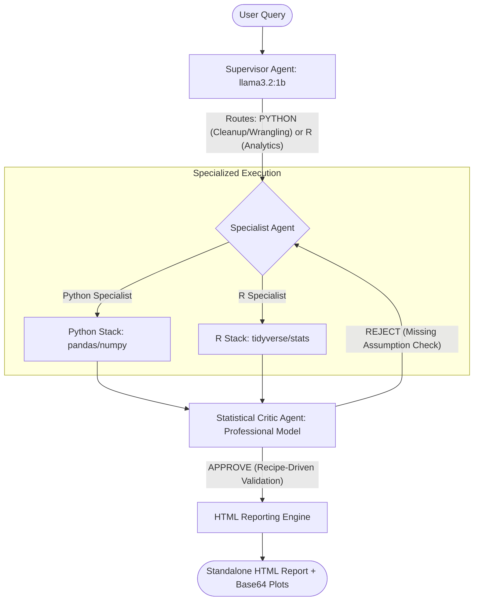

# AStats: Statistical Methodology & Architectural Rigor

AStats is a from-scratch harness designed to explore and define **robust practices** for agentic AI in statistical practice. It bridges the gap between chaotic freeform AI and validated, recipe-driven tools like **JASP and Jamovi**.

---

## 🏗️ Gen-3 Architecture: The Hybrid Specialist Loop

AStats uses a specialized **Supervisor → Specialist → Critic** loop to ensure every statistical claim is mathematically verified.

---

## 1. Hybrid Language Strategy (Python & R)

We acknowledge the fundamental trade-off in the data science ecosystem:
-   **R** is statistically more sophisticated but often less familiar to LLMs' training data.
-   **Python** is widely understood by models but can lack the mathematical nuance found in specialized R libraries.

AStats addresses this by using an **intelligent bifurcated workflow**:
1.  **Python Specialist:** Used for data auto-discovery, summarization, and cleaning, leveraging the LLM's deep familiarity with the Python data stack.
2.  **R Specialist:** Used for advanced statistical modeling and hypothesis testing where R's rigor is unmatched.

---

## 2. Recipe-Driven Workflow (The Critic)

Practitioners already use validated, recipe-driven methods to guide their use of statistical tools. AStats enforces these recipes through its **Statistical Critic Agent**.

Instead of simply running code and returning a p-value, the **Critic Agent** acts as a human-in-the-loop supervisor:
1.  **Verification of Assumptions:** If a specialist attempts aparametric test (like a t-test), the Critic verifies that normality and homoscedasticity were checked.
2.  **Methodological Rejection:** If the specialist skips a crucial step, the Critic **REJECTS** the output, providing specific feedback (e.g., *"You must check for multicollinearity using VIF before fitting this regression"*).
3.  **Human Validation:** All results are presented in a manner that allows final verification by the human practitioner, ensuring the analysis is **augmented**, not just automated.

---

## 3. The Auto-Discovery Harness

Robust exploration starts with understanding. AStats begins every lifecycle with a **data auto-discovery pipeline**:
-   Profiles columns and detects missing values.
-   Identifies discrete vs. continuous variables.
-   Generates a structured summary report that defines the "state of the world" before any complex analysis begins.

---

## 4. Open-Weight Optimized

To reduce costs and improve predictability, AStats is designed to be **model-agnostic**.
-   **Supervisor Roles:** Can be handled by massive commercial models or locally installed small open-weight models (e.g., **Llama 3.2:1B**) to minimize cost.
-   **Specialist Roles:** Leverages larger specialized models (e.g., GPT-4o, Claude 3.5) for the heavy mathematical heavy lifting when required.

AStats provides the framework for practitioners to fine-tune workflows—and eventually models—for specific statistical domains.
