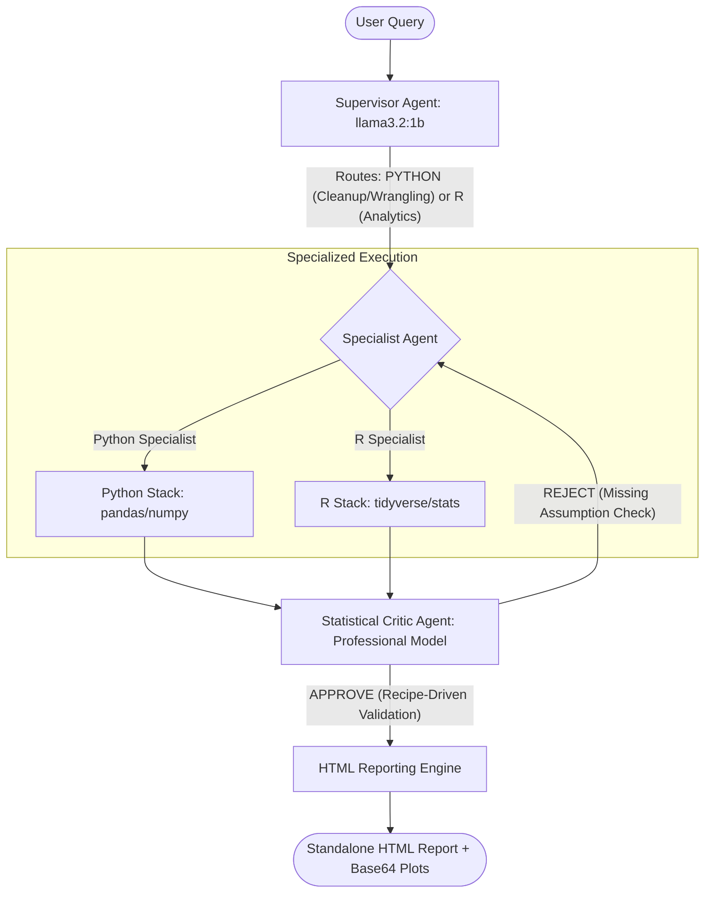

# AStats (GSoC 2026 Prototype) 🚀

An agentic-AI engine for **applied statistical practitioner workflows**, built with a native **Gen-3 Multi-Agent Architecture**.

> **Note:** This framework is designed for high-memory efficiency (<4MB footprint), making it ideal for laptop research and academic **Slurm cluster** environments where standard AI libraries often fail.

---

## 🏗️ Gen-3 Architecture: The Hybrid specialist Loop

AStats uses a specialized **Supervisor → Specialist → Critic** loop to ensure every statistical claim is mathematically verified.




---

## ✨ Key Features

*   **Interactive Setup (`astats init`)**: A high-polish CLI wizard to configure your models and API keys without touching YAML.
*   **Zero-SDK Native Router**: Built-in support for **OpenAI, Google Gemini, Anthropic, and Groq** with 10x lower memory overhead.
*   **Self-Correcting R-Bridge**: Automatically detects missing R packages and prompts for installation.
*   **Publication-Ready Reports**: Generates standalone HTML files with **Base64-embedded plots** for zero-dependency sharing.

---

## 🛠️ Quickstart

### 1. Installation
```bash
git clone https://github.com/m2b3/AStats.git
cd AStats
pip install -r requirements.txt
```

---

## 🧪 Validation & Testing

AStats has been end-to-end validated on foundational data science datasets to ensure statistical correctness:

| Dataset | Rows | Task | What It Demonstrates |
|---|---|---|---|
| **Fisher's Iris** | 150 | Exploratory Data Analysis | Auto-profiling, numerical grouping, Matplotlib chart generation. |
| **Diabetes** | 442 | Regression Modeling | OLS fitting, data wrangling, R-subprocess translation. |
| **Titanic** | 100+ | Hypothesis Testing | Categorical distributions, survival rates, missing value imputation. |

To run the full unit test suite (testing router resilience, Critic parsing, and multi-provider capability):
```bash
pytest tests/ -v
```

---

## 📚 Methodology 

AStats enforces mathematically correct workflows. The built-in **Statistical Critic Agent** peer-reviews results before an HTML report is generated.

- Detailed Methodology: [METHODOLOGY.md](METHODOLOGY.md)

---

*Part of the Google Summer of Code 2026 Proposal for INCF/AStats.*
